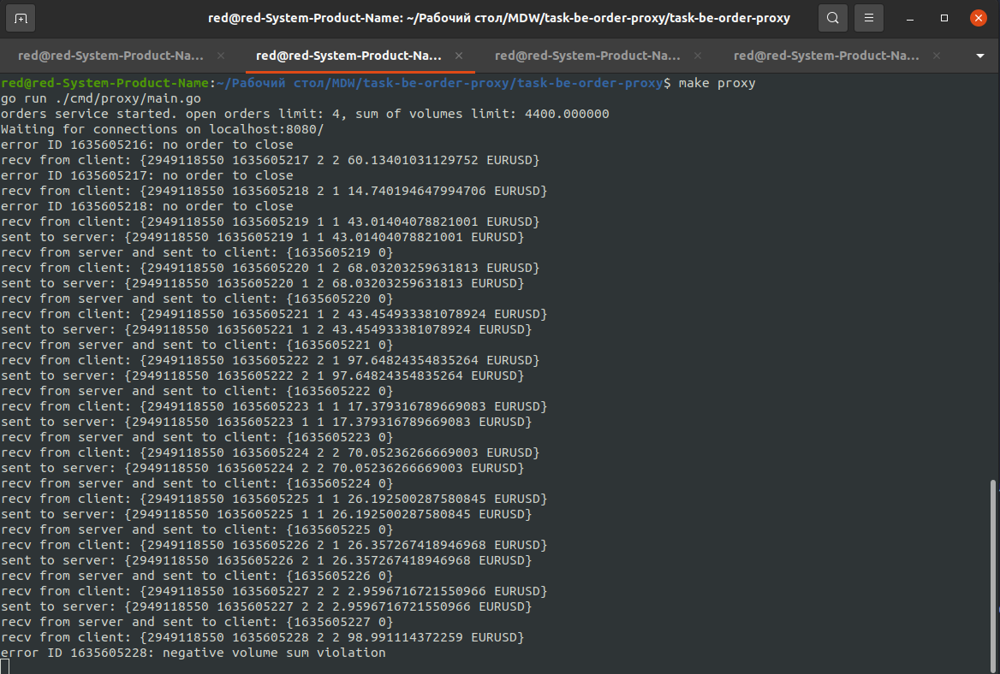

# Proxy server component

## Task description

Task description is in [DESCRIPTION.md](DESCRIPTION.md)

## Issues found in task description and fixed

- `signal.Notify` wasn't cathing SIGTERM signal
- `proxy.OrderRequest` had a `uint8(rand.Uint32())` randomizer, which will return 1 or 2 *very* rarely. Not good for testing purposes

## Solution notes

- :trophy: standard Go library (except for Gorilla Websocket package)
- :arrow_right_hook: clean architecture (handler->service)
- :book: standard Go project layout
- :hammer: Makefile included
- :toilet: tests with mocks included

## HOWTO

- start server with 
```bash
make server
```
- then start proxy component with some restrictions 
```bash
make proxy N=5 S=7000
```
where N is a limit of opened orders per client per instrument at the moment of time
and S is the sum limit of volumes of opened orders per client per instrument at the moment of time
- finally, start the client:
```bash
make client
```
- test with
```bash
make test
```

## A picture is worth a thousand words


